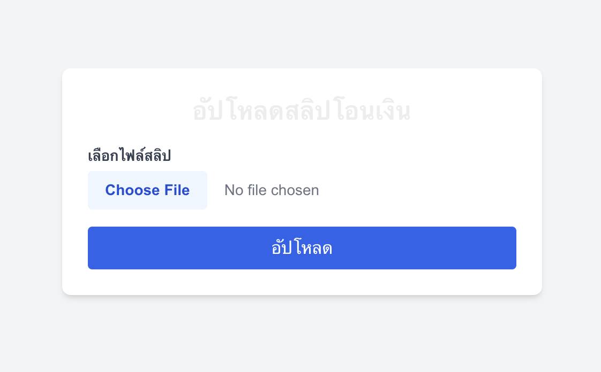

# Next.js EasySlip Verify

This is a [Next.js](https://nextjs.org) project bootstrapped with [
`create-next-app`](https://nextjs.org/docs/app/api-reference/cli/create-next-app).

## Getting Started

### 1. Clone the Repository

First, clone the repository to your local machine:

```bash
git clone https://github.com/your-username/nextjs-easyslip-verify.git
cd nextjs-easyslip-verify
```

### 2. Install Dependencies

Install all required dependencies using one of the following commands:

```bash
npm install
# or
yarn install
# or
pnpm install
# or
bun install
```

### 3. Configure Environment Variables

Create a .env.local file in the root of your project and add the following:

```bash
NEXT_PUBLIC_EASYSLIP_API_TOKEN=your_api_token_here
```

### 4. Run the Development Server

Start the development server using one of the following commands:
```bash
npm run dev
# or
yarn dev
# or
pnpm dev
# or
bun dev
```
Once the server is running, open your browser and navigate to:

http://localhost:3000

## Preview

Here is an example of the payment slip upload UI:



## Editing the Project
You can start editing the project by modifying the following files:

Home Page: src/app/page.tsx
This file contains the main logic for uploading and verifying payment slips.
Global Styles: src/app/globals.css
Add or modify global CSS styles here.
The application will auto-update as you make changes to these files.

## Project Features
Upload Slips: Upload .png or .jpg payment slips for verification.
Verify with EasySlip: Integrates with the EasySlip API to validate payment slips.
Responsive Design: Built with Tailwind CSS for a modern, mobile-friendly interface.

## Learn More
To learn more about Next.js and its features, check out these resources:

Next.js Documentation - Comprehensive documentation for Next.js.
Learn Next.js - Interactive tutorials for Next.js.
Next.js GitHub Repository - Contribute and provide feedback to the Next.js community.


## Deploy on Vercel
The easiest way to deploy this Next.js project is by using the Vercel Platform.

Follow these steps to deploy:

Log in to Vercel.
Click New Project and import your GitHub repository.
Vercel will automatically detect the project settings (Next.js).
Click Deploy and wait for the deployment process to complete.
For more details, refer to the Next.js Deployment Documentation.
